# 행렬
---
## 행렬이란?

### 1. 행렬이란 무엇인가?

#### 1) 행렬의 정의
- 행렬은 몇 개의 수나 문자를 직사각형 형태로 나타낸 것을 의미한다.

ex)


$$
A = \begin{bmatrix} 
1 & 3 & 2 \\ 
5 & 1 & 7 
\end{bmatrix}
$$
이 때 가로줄을 행, 세로줄을 열로 일컫는다.

$$
\begin{array}{c|c}
 & 1열 & 2열  & 3열\\
\hline
1행 & 1 & 3 & 2 \\
2행 & 5 & 1 & 7 \\
\end{array}
$$
이 A행렬의 경우, 2 x 3 matrix라고 한다.

행렬을 이루는 수나 문자를 ```행렬의 성분```이라고 부른다.
위의 예제에서 7의 경우 2행 3열에 위치하므로 (2,3)성분이라고 부른다.

#### 2) 기호 표현

$$
A = \begin{bmatrix}
a_{11} & a_{12} \\
a_{21} & a_{22}
\end{bmatrix}
$$
- 행렬은 대문자로 표현한다.
- 성분은 소문자로 표현한다.
- $a_{12}$ 의 경우 1행 2열에 존재하는 성분이므로 (1,2) 성분이라고 한다.
- 즉 $(i,j)$ 성분을 보통 $a_{ij}$
또는 $b_{ij}$로 나타낸다.


### 2. 행렬의 특징은 무엇인가?

행렬의 특성에는 피벗(pivot), 랭크(rank), 가역성(invertible), 벡터공간(Vector space)가 있다.

#### 1) 피벗
    

#### 2) 랭크
행렬 A의 랭크는 $rank(A)$로 표기하며

#### 3) 가역성

#### 4) 벡터 공간

### 3. 열 벡터와 행 벡터
#### 열벡터
- 1개의 열과 m개의 행으로 구성된 행렬이다.
- $(m$ x $1)$ 행렬이다.
$$
\begin{bmatrix}
x_1 \\
x_2 \\
\vdots \\
x_m
\end{bmatrix}
$$

#### 행벡터
- 1개의 행과 n개의 열로 구성된 행렬이다.
- $(1$ x $n)$ 행렬이다.

$$
\begin{bmatrix} x_1 & x_2 & \cdots & x_n \end{bmatrix}
$$

이 두 행렬은 사실상 벡터처럼 사용할 수 있어서 ```벡터```라는 이름을 붙여주었다.

<p/>

#### 벡터란?
벡터를 보는 관점은 크게 세 가지가 있다. 

- 물리학의 관점

    물리학을 배운 사람의 관점에서, 벡터는 ```화살표```이다. 즉 벡터는 ```길이```와 ```방향```을 갖는다. 길이와 방향이 같을 경우 동일한 벡터라고 할 수 있다.

- 컴퓨터 과학의 관점

    벡터는 순차 숫자 리스트이다. 예를 들어, 주택 가격 분석 작업을 하고 있다고 가정하자. 그러면 각각의 집을 숫자쌍 ```(면적, 가격)```으로 표현할 수 있다. 이 때 집을 2차원 벡터로 모델링했다고 말할 수 있다. 이 관점에서 "벡터"란 단순히 "리스트"를 달리 표현한 말이다. 이 때 2차원 벡터라고 말한 이유는 리스트의 길이가 2이기 때문이다.

- 수학자의 관점

    수학자의 관점은 좀 더 일반화한 관점으로, 무엇이든 벡터가 될 수 있다. 이 관점에서는 벡터를 좌표계 안에 있고, 꼬리가 ```원점```인 화살표로 표현한다. 벡터를 화살표로 표현한다는 점에서 물리학 관점과 비슷하지만, 벡터를 공간 어디로든 자유롭게 이동할 수 있었던 물리학 관점과는 달리 수학자의 관점에서 벡터를 나타내는 화살표의 경우 원점에 붙어 있다. 이 관점에서 벡터의 좌표는 숫자쌍이다. 이 숫자쌍은 꼬리(원점)에서 시작한 벡터가 끝에 어떻게 다다를지 알려준다.
    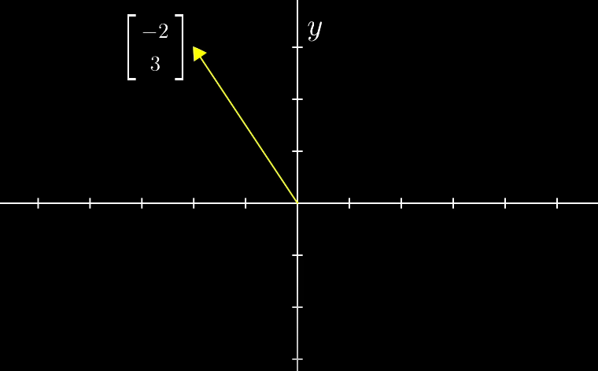
    이 떄, 첫 번째 숫자는 x축을 따라 얼마나 가는지 알려준다. 숫자의 부호는 방향을 알려준다. +면 오른쪽 방향 -면 왼쪽방향이다.

    두 번째 숫자는 y축을 따라 얼마나 가는지 알려준다.+면 윗 방향 -면 아래쪽방향이다.
    좌표점 $(-2,3)$ 과 구분하기 위해 벡터는 관례적으로 대괄호 안에 세로 방향으로 숫자를 적는다.
- 벡터의 표현
    $$
    \begin{bmatrix}
    -2 \\
    3
    \end{bmatrix}
    $$ 


### 4. 행렬의 기초와 행렬의 종류


    행렬은 모양과 구조, 특징에 따라 몇 가지로 구분할 수 있다.

#### 정방행렬
- 행의 개수와 열의 개수가 같은 ```정사각형```모양의 행렬을 말한다. $n$ x $n$ 행렬로 표기하고, '$n$ 차 정사각행렬'이라고 말한다. 
- $M_n(F)$로 표현한다.
#### 영행렬
- 행렬의 모든 성분이 0으로 구성되어 있는 행렬을 말한다.
- $O$ 로 표현한다.
- 어떤 행렬에 영행렬을 곱하면 반드시 영행렬이 된다.
- 어떤 행렬에 영행렬을 더하면 자기 자신이 된다.
- 행렬 덧셈에 대한 ```항등원```이다.
$$
O_{3,3} = \begin{bmatrix}
0 & 0 & 0\\
0 & 0 & 0\\
0 & 0 & 0\\
\end{bmatrix}
$$
#### 항등 행렬(단위 행렬)
- 대각 성분이 모두 1인 정사각 행렬이다.
- 단위 행렬이라고도 한다.
- 어떤 행렬에 항등행렬을 곱하면 자기 자신이 된다.
- 행렬곱의 ```항등원```이다.
$$
I_3 = \begin{bmatrix}
1 & 0 & 0\\
0 & 1 & 0\\
0 & 0 & 1\\
\end{bmatrix}
$$
#### 전치행렬
- 행렬의 오른쪽 위에 $T$ 를 달아 표기한다.
- 행과 열을 뒤집은 행렬을 말한다.
- 대각 성분을 기준으로 양쪽이 뒤바뀌는 성질을 갖고 있다.
- $m$ X $n$ 행렬의 전치는 $n$ X $m$ 행렬이다.

$$
A = \begin{bmatrix}
1 & 2 & 3 \\
4 & 5 & 6
\end{bmatrix} 
\to 
A^T = \begin{bmatrix}
1 & 4 \\
2 & 5 \\
3 & 6
\end{bmatrix}
$$

  
#### 삼각행렬
- 대각 성분을 기준으로 위쪽 혹은 아래쪽 성분이 모두 0인 행렬을 의미한다.
- 하삼각 행렬: 위쪽 성분이 모두 0인 경우
- 상삼각 행렬: 대각성분 아래의 모든 성분이 0인 행렬

#### 역행렬
- 어떤 행렬에 그것의 역행렬을 곱하면 단위 행렬이 된다.
- 행렬곱의 ```역원```이다.

### 5. 연립방정식과 행렬의 연관성

#### 1) 연립 방정식을 행렬로 표현하기
연립 방정식은 행렬의 곱으로 표현할 수 있다.

예를 들어 아래와 같은 방정식이 있다고 하자.

$$
\begin{cases}
2x + 5y + 3z = -3 \\
4x + 0y + 8z = 0 \\
1x + 3y + 0z = 2
\end{cases}
$$
각 방정식 내에서, 각 변수의 역할은 어떤 상수를 스케일링하는 것이다. 그리고 스케일된 변수들을 서로 더한 식이 방정식이다.
이 방정식들은 하나의 벡터 방정식으로 표현이 가능하다.

$$
\begin{bmatrix}
2 & 5 & 3\\
4 & 0 & 8\\
1 & 3 & 0\\
\end{bmatrix}
\begin{bmatrix}
x\\
y\\
z\\
\end{bmatrix}
=
\begin{bmatrix}
-3\\
0\\
2\\
\end{bmatrix}
$$
상수 계수만 모아서 행렬을 만들고, 변수들을 모아 벡터를 만들어서 곱셈 연산을 하면, 상수 벡터와 동일해진다.

이를 첨가 행렬로 표현하면 다음과 같다.
$$
\left[\begin{array}{ccc|c}
2 & 5 & 3 & -3 \\
4 & 0 & 8 & 0 \\
1 & 3 & 0 & 2 \\
\end{array}\right]
$$

#### 2) 기본행 연산의 개념

기본행 연산에는 세 가지 과정이 포함돼있다.

1) 두 행을 ```서로 교환```하기
2) 한 행의 모든 성분에 ```상수 k``` 곱하기
3) 한 행에 ```다른 행의 상수배```를 더하기

위의 과정을 거쳐도 `해가 변하지 않는다`라는 사실이 핵심이다.

#### 3) 기본행 연산 적용하여 `기약행 사다리꼴 형식` 만들기

- 기약행 사다리꼴 형식의 조건
    - 각 행의 0이 아닌 첫 성분(선두성분)은 1이다.
    - 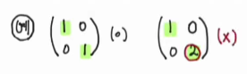
    - 0으로만 이루어진 행이 있다면 가장 밑에 있다.
    - 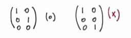
    - 선두성분인 1이 있는 열의 나머지 성분은 0이다.
    - 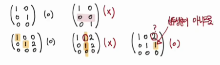

기약행 사다리꼴을 만들고 나면, 행끼리 순서를 바꿔 1이 대각선에 오도록 바꿔준다.


위에서 배운 내용을 아까 보았던 행렬에 적용하여 문제를 풀면 다음과 같다.

Step 1: 일차 방정식을 행렬 형태로 나타내기

$$
\left[\begin{array}{ccc|c}
2 & 5 & 3 & -3 \\
4 & 0 & 8 & 0 \\
1 & 3 & 0 & 2 \\
\end{array}\right]
$$

Step 2: 첫 번째 피벗 요소를 기준으로 0으로 만들기

$$
\left[\begin{array}{ccc|c}
2 & 5 & 3 & -3 \\
0 & -10 & 2 & 6 \\
1 & 3 & 0 & 2 \\
\end{array}\right]
$$

Step 3: 두 번째 피벗 요소를 기준으로 0으로 만들기

$$
\left[\begin{array}{ccc|c}
0 & -1 & 3 & -7 \\
0 & -10 & 2 & 6 \\
1 & 3 & 0 & 2 \\
\end{array}\right]
$$

Step 4: 세 번째 피벗 요소를 기준으로 0으로 만들기

$$
\left[\begin{array}{ccc|c}
0 & 1 & -3 & 7 \\
0 & 0 & 1 & 3 \\
1 & 3 & 0 & 2 \\
\end{array}\right]
$$


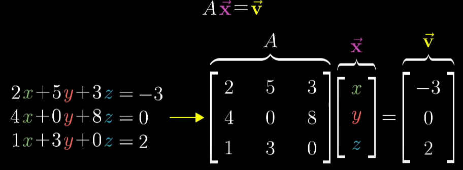
여기서 행렬 A는 선형 변환을 나타내며, 이 문제는 변환된 후 벡터 v가 되는 벡터 x를 구하는 문제이다.

이 방정식의 해를 찾기 위해서는 행렬 A의 변환이 모든 공간을 더 낮은 차원으로 축소시키는지 축소시키지 않는지 확인하는 단계를 거쳐야 한다.

즉, 행렬 A의 행렬식 값이 0인지, 0이 아닌지부터 확인해야 한다.
 
$det(A) \neq 0$ 인 경우, 특정 벡터 v로 변할 수 있는 x 벡터는 항상 하나만 존재한다. 이 경우 변환을 역방향으로 돌리면 벡터 x를 구할 수 있다. 이 때, 역으로 변환해주는 행렬을 ```A의 역행렬```이라 한다.
$A^{-1}AX = IX$ 이다.
이 때,$I$ 는 행렬곱의 항등원이므로 $IX = X$ 이다.

여기서 아무것도 하지 않는 변환을 ```"항등 변환"``` 이라고 부른다.

$$
A^{-1}A = \begin{bmatrix}
1 & 0 \\
0 & 1 \\
\end{bmatrix}
$$

이를 적용해 $AX = V$ 에서 우변 좌변에 각각 $A^{-1}$ 를 곱해주면

$$IX = X = A^{-1}V$$ 
가 되고 이 행렬의 곱을 계산하여 x를 구할 수 있다.


하지만, $det(A) = 0$ 인 경우, 역행렬을 구할 수 없다. 차원을 

### 6. 행렬식

#### 행렬식이란?
- 행렬식은 정사각형 행렬에서만 정의되는 개념으로서 `determinant`라고 한다.
- 기호로 $det(A)$ 또는 $|A|$로 나타낸다.
- 행렬식은 `수`이다.

#### 행렬식이 사용되는 경우
1. 연립일차방정식의 해를 구할 떄
2. <span style="color:red">역행렬의 존재성</span>을 판별할 때
3. <span style="color:red">고유값</span>을 계산할 때

#### 행렬식의 기하학적인 의미

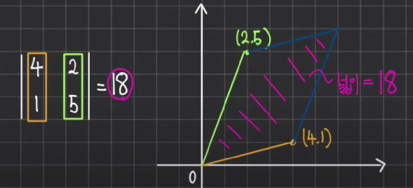
2차 정사각행렬의 행렬식은 평행 사변형의 넓이와 관련있다.

- 스케일링 벡터는 선형 변환에 의한 영역의 변화를 나타내는 팩터로서 행렬식(determinant)이라고 불린다.

예를 들어, 한 변환의 행렬식(det) 값이 3이라면, 특정 지역의 크기는 팩터 3만큼 증가한다.
$$
\begin{vmatrix}
0.0 & 2.0 \\
-1.5 & 1.0 \\
\end{vmatrix} = 3.0
$$
행렬식의 절댓값이 1/2라면 전체 영역 크기를 1/2 크기로 축소시키는 것을 의미한다.
<p/>
2차원 변환의 행렬식의 절댓값이 0이라면, 공간의 차원이 줄어들어 선 또는 점이 되었다는 뜻이다.
<p/> 
i-hat과 j-hat이 점점 가까워질수록, 두 개의 벡터가 이루는 각도가 작아질수록 det의 값은 0에 가까워진다. 
<p/>
그러다가 i-hat과 j-hat이 완전히 한 선을 이루게 되면 det가 0이 되는 것이다.
<p/>
행렬식의 부호는 공간의 방위를 나타낸다.

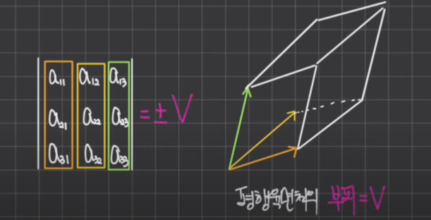

3차 정사각행렬의 행렬식은 평행육면체의 부피와 같다.


#### 2x2 행렬식 계산 공식

- 2차 정사각행렬의 행렬식을 계산하는 공식은 다음과 같다.

$$ \text{det} \left( \begin{bmatrix} a & b \\ c & d \end{bmatrix} \right) = ad - bc $$

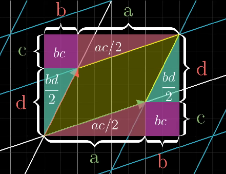
- a*d : 
- b*c : 평행사변형이 대각선 방향으로 얼마나 늘려지거나 찌그러 졌는지를 알려주는 수치이다.


#### 3x3 행렬식 계산 공식 - 방법 1 [대각선 법칙]
- 3차 정사각형행렬의 행렬식을 계산하는 공식은 다음과 같다.

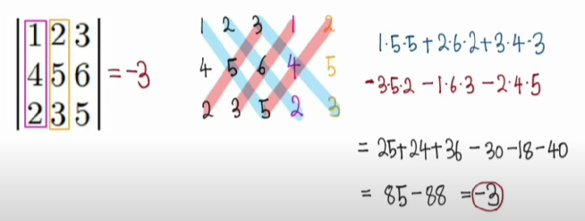
파란색 대각선끼리 다 곱해서 더한 뒤, 빨간색 대각선 성분들끼리 곱해서 빼면 행렬식을 구할 수 있다.

#### 3x3 행렬식 계산 공식 - 방법 2 [여인수 전개]

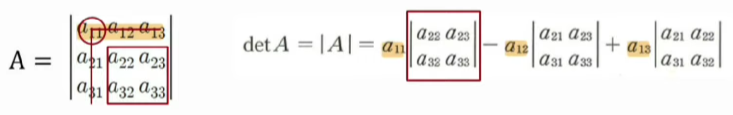
- 이 방법은 모든 정사각행렬의 행렬식을 구할 때 사용할 수 있다.
- 0을 성분으로 갖고 있는 행 또는 열을 선택하면 간편하게 계산할 수 있다.
- 대각 행렬의 행렬식은 대각 성분의 곱과 같다.

#### 기본행 연산과 행렬식의 관계

앞에서 배운 기본행 연산에는 세 가지가 있었다. 다음과 같은 행렬 A가 있다고 해보자.
$$
A = \begin{vmatrix}
1 & 2\\
3 & 4
\end{vmatrix} 
= -2
$$
1. 두 행을 서로 교환하기 

    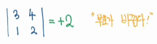

    두 행을 서로 교환한 뒤 행렬식을 구하면 부호가 바뀌는 것을 확인할 수 있다.

2. 한 행의 모든 성분에 상수 k 곱하기

    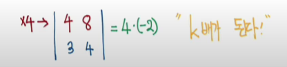
    
    결국에 k(ac - bd) 이므로 행렬식이 k배 된다.

3. 한 행에 '다른 행의 상수배'를 더하기

    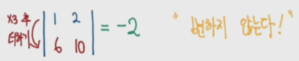

    $a*(bk + d)- b*(ak + c) = ad - bc$이다.

- 다양한 행렬식을 구할 때 매우 유용한 성질이다.

#### 행렬식 관련 성질
1. $|A^T| = |A|$
2. $|AB|=|A||B|=|B||A| = |BA|$ **

### 7. 대각화

#### 대각화의 의미

- 어떤 행렬 $A$ 가  대각화 가능하다 $<=> A = PDP^{-1}$ 인 $P, D$가 존재한다.
- 이 떄, $P$ 는 역향렬을 갖는 행렬이다.
- $D$ 는 대각행렬이다. 대각 성분을 제외하고 모두 0인 행렬을 의미한다.
- 행렬 $A를 PDP^{-1}로 바꿔주는 과정을 "대각화한다"고 말한다.$

#### 대각화를 하는 이유

- 대각 행렬은 `거듭제곱`이 편리하다.
$$
D = \begin{pmatrix}
2 & 0\\
0 & 3
\end{pmatrix} 
\to
D^2 = \begin{pmatrix}
2 & 0\\
0 & 3
\end{pmatrix} 
\begin{pmatrix}
2 & 0\\
0 & 3
\end{pmatrix} 
=
\begin{pmatrix}
2^2 & 0\\
0 & 3^2
\end{pmatrix} 
$$

- 즉 대각행렬 $D의 n제곱은 다음과 같이 나타낼 수 있다.$
$$
D^n = 
\begin{pmatrix}
2^n & 0\\
0 & 3^n
\end{pmatrix} 
$$

- $A$ 를 $PDP^{-1}$ 형태로 만들면 $A$ 또한 쉽게 계산할 수 있다.

$$
A^2 = (PDP^{-1})(PDP^{-1}) = (PD)(P^{-1}P)(DP^{-1}) = (PD)(I)(DP^{-1}) = PD^2P^{-1}\\
\vdots \\
A^n = PD^nP^{-1}
$$

#### 대각화가 가능할 조건

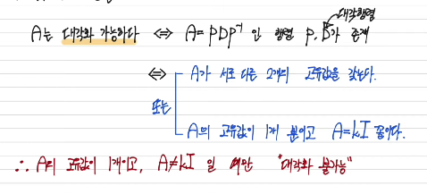

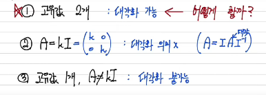

#### 대각화하는 방법
- ##### 공부해야해...


### 8. 내적 공간

#### 내적이란?

수치적으로, 같은 차원의 두 벡터는 같은 길이의 리스트와 같다.
두 벡터의 내적이란, 좌표를 원소별로 짝지어 서로 곱한 뒤, 모두 더한 결과이다.

$$

\begin{bmatrix}
1 \\ 2
\end{bmatrix}
\cdot 
\begin{bmatrix}
3 \\ 4
\end{bmatrix}
= 1\cdot3 + 2\cdot4 
$$

#### 기하학적 해석
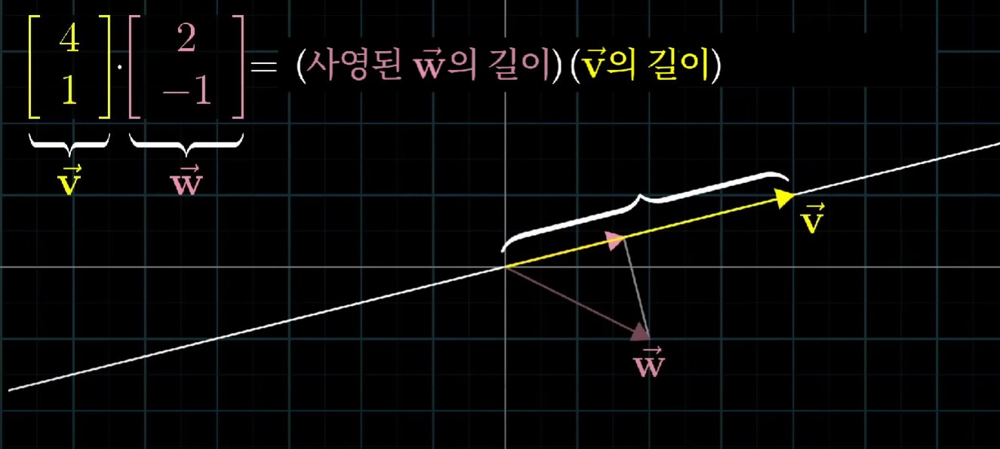
이 때 부호는 w와 v가 같은 방향을 보고 있으면 양수, 반대 방향을 가리키면 음수가 된다.


### 9. 행렬과 선형변환

#### 선형 변환
- 선형대수학에서 변환은 어떤 벡터를 집어넣을 때 다른 벡터를 내놓는다.
- 한 행렬은 하나의 선형 변환을 의미한다.
- 공간이 움직이는 방식 중 하나로, 격자선이 평행하고 균등한 상태를 유지하면서 원점은 고정돼 있는 것을 만족하는 변환이다.

    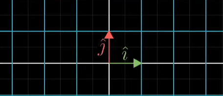

    기저벡터인 i-hat과 j-hat이 각각 (1, 0), (0, 1)에서 다른 좌표로 변화했을 때 좌표(x, y)는 어떻게 변할 것인지를 변환된 i-hat과 j-hat만 알면 구할 수 있다.

    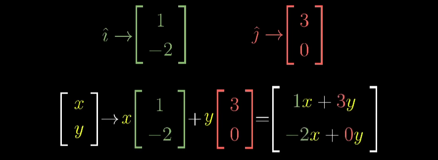
    
    즉 기저벡터를 스케일하여 더하는 아이디어로 이해하면 된다.


- 벡터에 행렬을 곱하는 것은 수식적으로 그 벡터를 선형 변환하는 것과 같다.
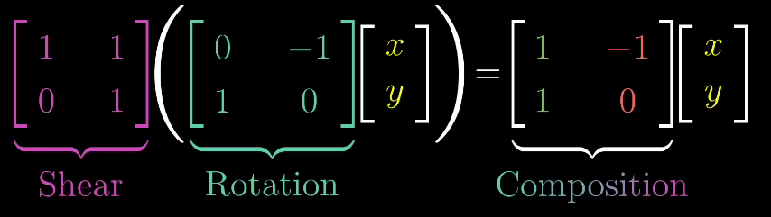

#### 선형 변환의 두 가지 성질
1. 모든 직선은 휘지 않고 직선인 상태를 유지한다.
2. 원점은 제자리에 고정돼 있다.

즉 격자선이 평행하고 균등한 상태를 유지해야 한다.


