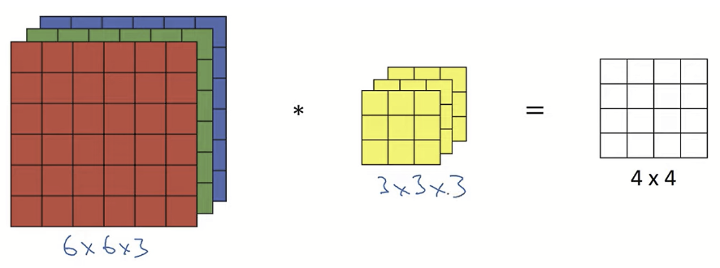
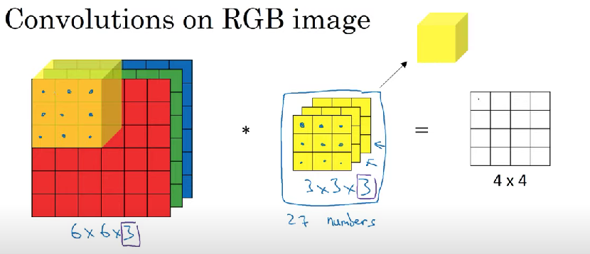
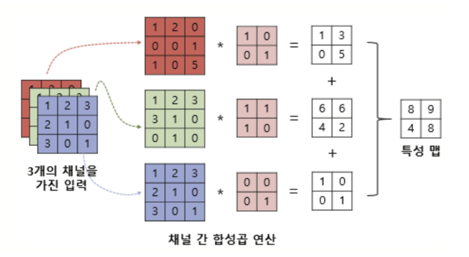
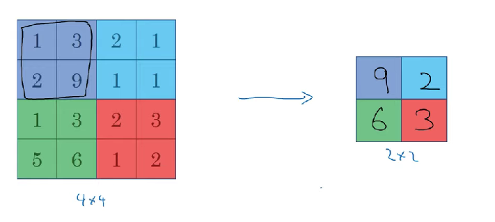
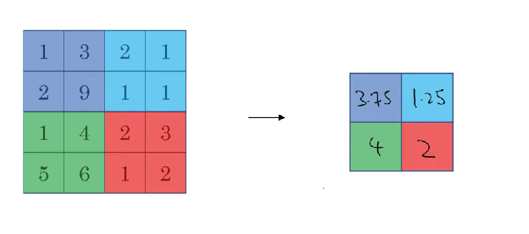
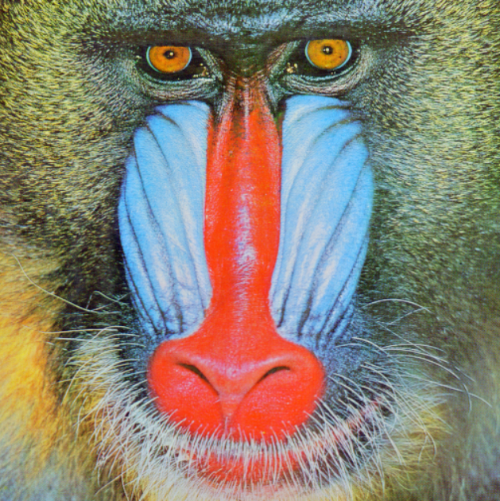

# 컨볼루션
## 컨볼루션 연산

- RGB 이미지의 컨볼루션 연산

Convolution(합성곱) 연산은 CNN을 포함한 다양한 딥러닝 과정에서 활용되는 연산이다.

살펴보려는 이미지가 6 x 6 사이즈의 RGB 이미지인 경우, 
6 x 6 가 아닌 6 x 6 x 3으로 볼 수 있는데, 여기서 3은 세 개의 색상 채널에 해당한다.

이 때 이미지에서 윤곽선을 검출하거나, 여러 특성을 알아보기 위해서는 3 x 3 x 3크기의 3D 필터를 사용해야 한다.

이 때 이미지의 채널수와 필터의 채널수는 항상 같아야 한다.

`입력 이미지의 채널 수 = 필터의 채널 수`

아래의 이미지와 필터를 합성곱하고 나면 4 x 4 x 1의 크기가 된다.

<합성곱>

저 세 개의 행렬을 쌓은 것 같은 3 x 3 x 3 필터를 단순화시켜서 삼차원의 정육면체로 나타내볼 수 있다. 이때 합성곱 연산은 이전이랑 같은 방법이다. 이 정육면체의 필터를 입력 이미지의 가장자리부터 시작해 계산하면서 쭉 옮겨주면 된다.

필터안의 각각의 요소들을  빨강, 초록, 파랑 채널에 맵핑되는 수와 곱해준다. 마지막으로 각각의 채널에서 곱해서 나온 수들을 다 더해준다.. 그렇게 되면 특징 맵은 4 x 4 x 1 , 즉 하나의 채널만을 가지게 된다.

RGB 이미지의 합성곱 연산의 다른 예시다. 마찬가지로 3개의 채널을 가진 입력 이미지에 3개의 채널을 가진 하나의 필터로 합성곱 연산을 진행했을 때다. 결과로 하나의 채널을 가진 2차원 특성 맵이 나온다.

필터를 여러 개 사용하면 3차원 특성맵이 나오게 된다. 이 때 필터의 수가 특성 맵의 채널 수가 된다.

#### 컨볼루션의 출력 크기 구하는 방법
$$n -f + 1$$

## 풀링 연산

### maxpool

4 x 4 입력이 있고 최대 풀링을 적용하는 경우, 2 x 2의 출력이 나오게 된다.

이 때, 입력을 여러 구간으로 나눈 뒤 각 구간에서 가장 큰 수를 선택해 채워 넣으면 된다.

#### 최대 풀링의 하이퍼 파라미터
- $f = 2$ (필터 사이즈)
- $s = 2$ (스트라이드) 이동

최대 풀링을 적용하면, 필터의 한 부분에서 한 특성이 검출될 경우 높은 수를 남길 수 있다. 반대로 검출되지 않으면 작은 수를 남긴다.

최대 풀링에는 여러 하이퍼파라미터가 있지만, 경사하강법으로 학습할 수 있는 변수가 없다는 특징이 있습니다. $(f, s)$

#### 최대 풀링의 출력 크기 구하는 방법
$$n + 2p -f / s + 1$$

### avgpool

자주 사용되지 않는 풀링의 종류로 평균 폴링이다.
최댓값을 취하는 대신, 각 필터의 평균을 취한다.

이 경우 $f = 2, s = 2$ 의 평균 폴링이다.

평균 폴링의 경우 일반적으로 padding을 잘 사용하지 않는다.

## 실습
### 컨볼루션 연산을 반복문을 통해 구현해보자!
- 아래 주어진 baboon.png 이미지를 pure python의 반복문만 사용하여 컨볼루션 연산 후 결과물을 제시해야    한다.

    - 이미지를 불러오거나 이미지를 보여줄 때에는 다른 라이브러리를 사용해도 무관하다.
- 직접 커널의 만들어 다양한 연산을 수행해본다.
    - image sharpening
    - edge detection
    - image blur
    - baboon.png

    